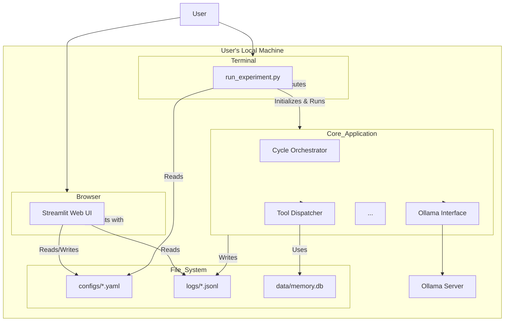
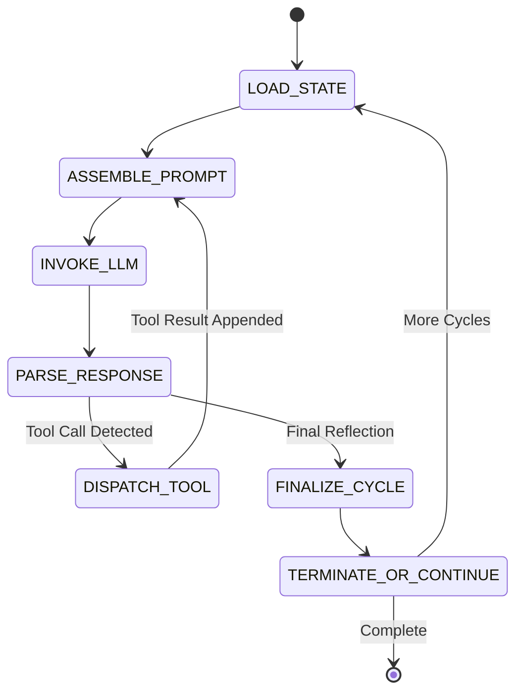
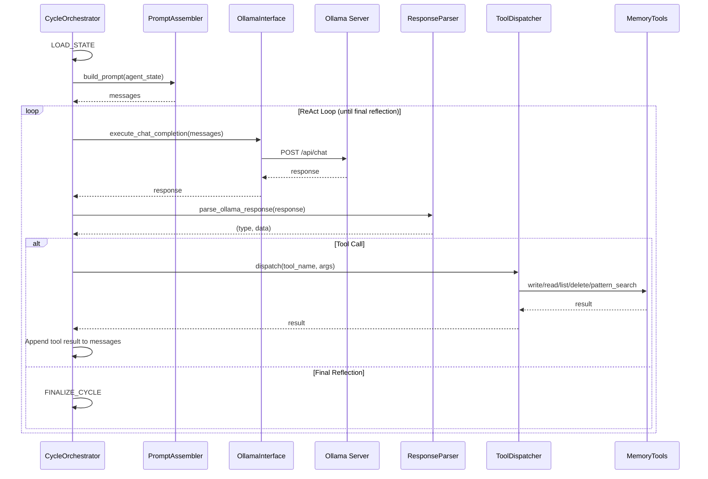
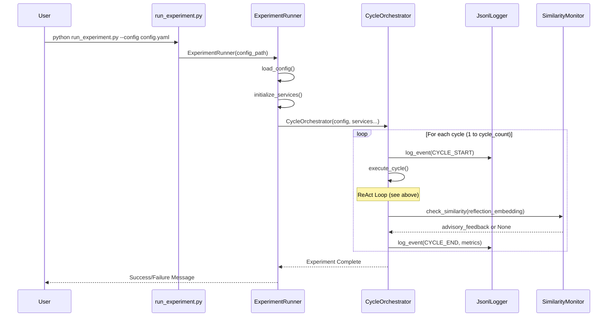
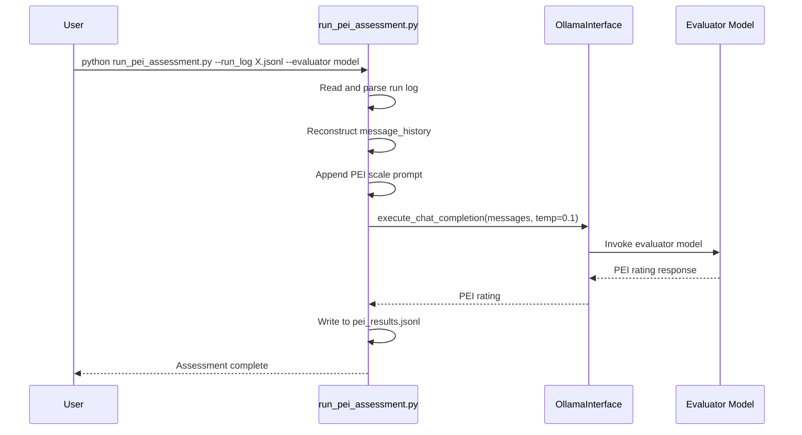

# ContReAct-Ollama Experimental Platform Fullstack Architecture Document

## Introduction

This document outlines the complete fullstack architecture for the ContReAct-Ollama Experimental Platform, including backend systems, frontend implementation, and their integration. It serves as the single source of truth for AI-driven development, ensuring consistency across the entire technology stack. This unified approach combines what would traditionally be separate backend and frontend architecture documents, streamlining the development process for modern fullstack applications where these concerns are increasingly intertwined.

### Starter Template or Existing Project

N/A - This is a greenfield project being built from scratch based on the provided specifications.

## High-Level Architecture

### Technical Summary

This project will be a locally-executed, Python-based application architected as a **Modular Monolith**. The system is composed of a core backend engine that runs experiments via a command-line interface, and a decoupled Streamlit-based web UI for configuration and analysis. Communication between the UI and the backend is handled asynchronously via the file system. The primary external dependency is a locally running Ollama server for LLM inference. This pragmatic, self-contained architecture is designed to be simple, portable, and easy to run on a personal machine, directly supporting the project's goal of providing a hands-on learning experience.

### Platform and Infrastructure Choice

**Platform**: Local User Machine. This application is not designed for cloud hosting; it is a standalone tool to be run on a developer's or researcher's personal computer.

**Key Services**: The platform relies on a minimal set of services:

- Python 3.9+ Runtime
- A locally running Ollama Server instance
- The local File System for data exchange and persistence (`configs/`, `logs/`, `data/`)

### Repository Structure

**Structure**: Monorepo. A single repository will contain the core application logic, the Streamlit UI scripts, analysis scripts, and all related documentation.

**Monorepo Tool**: N/A - A standard directory structure will be sufficient without the need for specialized monorepo management tools.

### High-Level Architecture Diagram



### Architectural Patterns

- **Modular Monolith**: The backend is designed with a clear separation of concerns between its primary components but is packaged and run as a single application.

- **State Machine**: The core ContReAct cycle is explicitly implemented as a formal state machine, providing a robust, predictable, and highly debuggable structure for the agent's complex operational loop.

- **Configuration-Driven Design**: The behavior of an experiment is entirely controlled by an external config.yaml file. This decouples the application logic from the experimental parameters, making runs highly reproducible and easy to manage.

- **Decoupled UI (via File System)**: The Streamlit UI and the core backend engine are completely decoupled. They do not share memory or have direct API calls; they communicate only by reading and writing files.

## Tech Stack

### Technology Stack Table

Note: The versions listed below are the minimum required versions. During implementation, newer stable versions may be used.

| Category | Technology | Version | Purpose | Rationale |
|----------|-----------|---------|---------|-----------|
| Backend Language | Python | 3.9+ | Primary language for the entire application. | Required for compatibility with key libraries. |
| Frontend Framework | Streamlit | 1.38.0+ | Framework for building the web-based UI. | Chosen for simplicity in creating data-centric apps. |
| Database | TinyDB | 4.8.0+ | Persistent key-value store for agent memory. | Lightweight, avoiding overhead of a full DB server. |
| API Interaction | ollama | 0.4.0+ | Official Python client for the Ollama platform. | Provides the fundamental interface to local LLMs. |
| Embeddings | sentence-transformers | 3.0.1+ | Generates semantic embeddings for text. | Used for the exploration diversity mechanism. |
| Numerical Ops | numpy / scipy | 1.26.4+ / 1.13.1+ | Numerical computing for vector operations. | Used for efficient calculation of cosine similarity. |
| Data Visualization | Plotly | 5.22.0+ | Library for creating interactive charts. | Enables rich visualizations within Streamlit. |
| Data Manipulation | Pandas | 2.2.2+ | Parses .jsonl files into DataFrames. | Used to structure log data for UI display. |
| Backend Testing | pytest | 8.2.2+ | Testing framework for the Python backend. | Industry standard for Python unit/integration testing. |
| Frontend Testing | pytest-playwright | 0.5.0+ | End-to-end testing for the Streamlit UI. | Allows for testing the UI in a real browser. |
| App Logging | Python logging | (built-in) | Application-level logging (errors, debug info). | Standard Python library for robust application logging. |

## Data Models

### AgentState

The AgentState is the primary in-memory object representing the agent's condition. It is passed between components and updated throughout each cycle.

**Python Dataclass Definition:**

```python
from dataclasses import dataclass, field
from typing import List, Dict, Any

@dataclass
class AgentState:
    """Represents the complete in-memory state of an agent at a point in time."""
    
    run_id: str  # Unique identifier for the experimental run (e.g., 'GPT5-A')
    cycle_number: int  # Current operational cycle number (e.g., 1-10)
    model_name: str  # Tag of the Ollama model being used (e.g., 'llama3:latest')
    message_history: List[Dict[str, Any]] = field(default_factory=list)  # Ordered list of all messages
    reflection_history: List[str] = field(default_factory=list)  # List of final reflection strings
```

**Message History Format:**

Each message in the `message_history` follows the Ollama chat format:

```python
{
    "role": str,  # One of: "system", "user", "assistant", "tool"
    "content": str  # The message content
}
```

### ExperimentConfig

Configuration loaded from YAML files defining experiment parameters.

**Python Dataclass Definition:**

```python
from dataclasses import dataclass
from typing import Dict, Any

@dataclass
class ExperimentConfig:
    """Configuration for a single experimental run."""
    
    run_id: str  # Unique identifier for this specific run
    model_name: str  # Model tag as recognized by local Ollama server
    cycle_count: int  # Total number of cycles to run (e.g., 10)
    ollama_client_config: Dict[str, Any]  # Configuration for Ollama client
    model_options: Dict[str, Any]  # Parameters for LLM generation
```

**Model Options Schema:**

```python
{
    "seed": int,  # Random number seed for reproducibility
    "temperature": float,  # Temperature of the model (higher = more creative)
    "top_p": float,  # Works with top_k for nucleus sampling
    "num_predict": int,  # Maximum tokens to generate (-1 = no limit)
    "repeat_last_n": int,  # How far back model looks to prevent repetition
    "repeat_penalty": float,  # How strongly to penalize repetitions
    "num_ctx": int  # Context window size
}
```

### MemoryEntry

Schema for entries in the persistent key-value store.

**Database Table Schema (agent_memory):**

- **run_id** (TEXT, NOT NULL): Unique identifier for the experimental run
- **key** (TEXT, NOT NULL): The key for the memory entry
- **value** (TEXT, NOT NULL): The value associated with the key
- **Primary Key**: (run_id, key)

**TinyDB Document Schema:**

```python
{
    "run_id": str,
    "key": str,
    "value": str
}
```

### LogRecord

Schema for structured log entries written to .jsonl files.

**Python Dataclass Definition:**

```python
from dataclasses import dataclass
from datetime import datetime
from typing import Dict, Any, Literal
from enum import Enum

class EventType(Enum):
    """Types of events that can be logged."""
    CYCLE_START = "CYCLE_START"
    LLM_INVOCATION = "LLM_INVOCATION"
    TOOL_CALL = "TOOL_CALL"
    CYCLE_END = "CYCLE_END"

@dataclass
class LogRecord:
    """A single, structured log entry for an experimental event."""
    
    timestamp: str  # ISO 8601 formatted timestamp
    run_id: str  # Identifier for the experiment run
    cycle_number: int  # The cycle in which the event occurred
    event_type: EventType  # The type of event being logged
    payload: Dict[str, Any]  # Event-specific data
```

**Payload Examples by Event Type:**

- **LLM_INVOCATION**: 
  ```python
  {
      "prompt_messages": [...],  # List of messages sent to LLM
      "response_message": {...},  # Response from LLM
      "model_options": {...}  # Generation parameters used
  }
  ```

- **TOOL_CALL**: 
  ```python
  {
      "tool_name": str,  # Name of tool invoked
      "parameters": {...},  # Arguments passed to tool
      "output": str  # Result returned by tool
  }
  ```

- **CYCLE_END**: 
  ```python
  {
      "final_reflection": str,  # Agent's reflection for the cycle
      "metrics": {  # Summary metrics
          "memory_ops_total": int,
          "messages_to_operator": int,
          "response_chars": int,
          "memory_write_chars": int
      }
  }
  ```

## API Specification

N/A - This local application does not expose an external API.

## Components

### 1. ExperimentRunner

**Purpose**: Top-level component and main entry point for the application.

**Responsibilities**:
- Parse experiment configuration from YAML file
- Initialize all service components
- Launch experimental runs
- Handle top-level error reporting

**Key Methods**:

```python
class ExperimentRunner:
    def __init__(self, config_path: str):
        """Initialize runner with path to configuration file."""
        
    def load_config(self) -> ExperimentConfig:
        """Load and validate YAML configuration file."""
        
    def initialize_services(self) -> dict:
        """Initialize all required services (Ollama, Logger, Tools, etc.)."""
        
    def run(self) -> None:
        """Execute the complete experimental run."""
```

### 2. CycleOrchestrator

**Purpose**: The heart of the system that manages execution of agent's operational cycles.

**Responsibilities**:
- Manage state machine transitions
- Direct control flow between states
- Determine when experimental run is complete
- Coordinate between all other components

**Key Methods**:

```python
class CycleOrchestrator:
    def __init__(self, config: ExperimentConfig, ollama_interface: OllamaInterface,
                 tool_dispatcher: ToolDispatcher, logger: JsonlLogger, 
                 similarity_monitor: SimilarityMonitor):
        """Initialize orchestrator with all necessary services."""
        
    def run_experiment(self) -> None:
        """Main public method executing full experimental run from Cycle 1 to cycle_count."""
        
    def _execute_cycle(self, agent_state: AgentState) -> AgentState:
        """Execute a single cycle of the ContReAct state machine."""
        
    def _load_state(self, cycle_number: int) -> AgentState:
        """LOAD_STATE: Load or initialize AgentState."""
        
    def _assemble_prompt(self, agent_state: AgentState) -> List[Dict]:
        """ASSEMBLE_PROMPT: Construct full context for LLM."""
        
    def _invoke_llm(self, messages: List[Dict]) -> Dict:
        """INVOKE_LLM: Send prompt to Ollama server."""
        
    def _parse_response(self, response: Dict) -> Tuple[str, Any]:
        """PARSE_RESPONSE: Determine if response contains tool calls or final reflection."""
        
    def _dispatch_tool(self, tool_call: Dict, agent_state: AgentState) -> str:
        """DISPATCH_TOOL: Invoke tool and return result."""
        
    def _finalize_cycle(self, agent_state: AgentState, reflection: str) -> None:
        """FINALIZE_CYCLE: Extract reflection, calculate embedding, log state."""
        
    def _should_terminate(self, cycle_number: int) -> bool:
        """TERMINATE_OR_CONTINUE: Check if target cycle count reached."""
```

### 3. PromptAssembler

**Purpose**: Stateless utility module for constructing LLM inputs.

**Responsibilities**:
- Build complete prompt with all required components
- Format messages according to Ollama chat format
- Append diversity feedback when applicable

**Key Function**:

```python
def build_prompt(agent_state: AgentState, system_prompt: str, 
                 tool_definitions: List[Dict], 
                 diversity_feedback: Optional[str] = None) -> List[Dict[str, str]]:
    """
    Construct the full prompt for LLM invocation.
    
    Args:
        agent_state: Current agent state with message history
        system_prompt: Base system prompt text
        tool_definitions: Structured tool definitions in JSON schema format
        diversity_feedback: Optional advisory feedback from SimilarityMonitor
        
    Returns:
        List of message dictionaries formatted for ollama.chat method
    """
```

### 4. ResponseParser

**Purpose**: Stateless utility module for interpreting Ollama responses.

**Responsibilities**:
- Check for presence of tool calls
- Validate tool call structure
- Extract final reflections
- Determine response type

**Key Function**:

```python
def parse_ollama_response(response: Dict) -> Tuple[str, Any]:
    """
    Parse response from ollama.chat call.
    
    Args:
        response: Response object from Ollama client
        
    Returns:
        Tuple of (response_type, data) where:
        - response_type: "TOOL_CALL" or "FINAL_REFLECTION"
        - data: List of tool calls or reflection string
    """
```

### 5. OllamaInterface

**Purpose**: Wrapper around ollama Python library for all LLM communication.

**Responsibilities**:
- Initialize ollama.Client with host configuration
- Verify model availability before experiments
- Execute chat completions with proper parameters
- Handle API-level errors with clear feedback

**Key Methods**:

```python
class OllamaInterface:
    def __init__(self, host: str = "http://localhost:11434"):
        """Initialize Ollama client with specified host."""
        self.client = ollama.Client(host=host)
        
    def verify_model_availability(self, model_name: str) -> bool:
        """
        Verify model exists locally.
        
        Calls ollama.list() and checks if model_name is present.
        Raises error with instructions to run 'ollama pull' if not found.
        """
        
    def execute_chat_completion(self, model_name: str, messages: List[Dict], 
                                tools: List[Dict], options: Dict) -> Dict:
        """
        Execute LLM chat completion.
        
        Args:
            model_name: Tag of model to use
            messages: Message history
            tools: Tool definitions in JSON schema format
            options: Generation parameters (temperature, seed, etc.)
            
        Returns:
            Response object from ollama.chat
            
        Raises:
            ollama.ResponseError: On connection or model errors
        """
```

### 6. ToolDispatcher

**Purpose**: Manage and invoke the suite of tools available to the agent.

**Responsibilities**:
- Maintain registry of available tools
- Route tool calls to appropriate functions
- Format tool results as messages
- Track tool usage for logging

**Key Methods**:

```python
class ToolDispatcher:
    def __init__(self, memory_tools: MemoryTools):
        """Initialize with memory tools instance."""
        self.tools = {
            "write": memory_tools.write,
            "read": memory_tools.read,
            "list": memory_tools.list,
            "delete": memory_tools.delete,
            "pattern_search": memory_tools.pattern_search,
            "send_message_to_operator": send_message_to_operator
        }
        
    def dispatch(self, tool_name: str, arguments: Dict) -> str:
        """
        Invoke requested tool with arguments.
        
        Args:
            tool_name: Name of tool to invoke
            arguments: Dictionary of arguments for the tool
            
        Returns:
            String result from tool execution
        """
        
    def get_tool_definitions(self) -> List[Dict]:
        """Generate JSON schema definitions for all available tools."""
```

### 7. MemoryTools

**Purpose**: Encapsulate all persistent memory operations.

**Responsibilities**:
- Provide CRUD operations on key-value store
- Support pattern-based searching
- Ensure multi-tenant isolation by run_id

**Key Methods**:

```python
class MemoryTools:
    def __init__(self, db_path: str, run_id: str):
        """Initialize with path to database file and current run_id."""
        
    def write(self, key: str, value: str) -> str:
        """
        Write value to specified key in persistent memory.
        Overwrites if key exists.
        Returns confirmation message.
        """
        
    def read(self, key: str) -> str:
        """
        Read value associated with specified key.
        Returns value or error if key not found.
        """
        
    def list(self) -> str:
        """
        List all keys currently stored.
        Returns comma-separated string of keys.
        """
        
    def delete(self, key: str) -> str:
        """
        Delete key and its associated value.
        Returns confirmation message.
        """
        
    def pattern_search(self, pattern: str) -> str:
        """
        Search for keys containing the given pattern string.
        Returns comma-separated string of matching keys.
        """
```

### 8. Operator Communication Tool

**Purpose**: Enable synchronous communication between agent and human operator.

**Implementation**:

```python
def send_message_to_operator(message: str) -> str:
    """
    Send synchronous message to human operator and wait for response.
    
    Args:
        message: The agent's message to the operator
        
    Returns:
        The operator's text response
        
    Implementation:
        - Print message to console with [AGENT]: prefix
        - Block and wait for operator input with [OPERATOR]: prompt
        - Return operator's entered text
    """
    print(f"[AGENT]: {message}")
    response = input("[OPERATOR]: ")
    return response
```

### 9. JsonlLogger

**Purpose**: Centralized logging service for all experimental events.

**Responsibilities**:
- Write structured log records to .jsonl file
- Ensure proper formatting and file locking
- Generate ISO 8601 timestamps
- Support concurrent writes (if needed)

**Key Methods**:

```python
class JsonlLogger:
    def __init__(self, log_file_path: str):
        """
        Initialize logger with output file path.
        Opens file in append mode.
        """
        
    def log_event(self, run_id: str, cycle_number: int, 
                  event_type: EventType, payload: Dict) -> None:
        """
        Log a single event to the file.
        
        Args:
            run_id: Experiment run identifier
            cycle_number: Current cycle number
            event_type: Type of event (CYCLE_START, LLM_INVOCATION, etc.)
            payload: Event-specific data
            
        Implementation:
            - Create LogRecord with current timestamp
            - Serialize to JSON string
            - Write line to file with newline
        """
```

### 10. EmbeddingService

**Purpose**: Generate semantic embeddings for text using sentence-transformers.

**Responsibilities**:
- Load and manage sentence transformer model
- Convert text to embedding vectors
- Provide consistent embedding dimensions

**Key Methods**:

```python
class EmbeddingService:
    def __init__(self, model_name: str = 'all-MiniLM-L6-v2'):
        """
        Initialize with specified sentence transformer model.
        Default: all-MiniLM-L6-v2 (384-dimensional embeddings)
        """
        from sentence_transformers import SentenceTransformer
        self.model = SentenceTransformer(model_name)
        
    def get_embedding(self, text: str) -> numpy.ndarray:
        """
        Convert text to embedding vector.
        
        Args:
            text: Input text (agent's reflection)
            
        Returns:
            384-dimensional numpy array embedding vector
        """
```

### 11. SimilarityMonitor

**Purpose**: Track reflection similarity and generate advisory feedback.

**Responsibilities**:
- Calculate cosine similarity between embeddings
- Apply threshold-based feedback rules
- Generate appropriate advisory messages

**Key Methods**:

```python
class SimilarityMonitor:
    def __init__(self, embedding_service: EmbeddingService):
        """Initialize with embedding service instance."""
        
    def check_similarity(self, new_reflection_embedding: numpy.ndarray, 
                        historical_embeddings: List[numpy.ndarray]) -> Optional[str]:
        """
        Check similarity of new reflection against historical reflections.
        
        Args:
            new_reflection_embedding: Embedding of latest reflection
            historical_embeddings: List of all previous reflection embeddings
            
        Returns:
            Advisory feedback string if similarity exceeds threshold, None otherwise
            
        Thresholds:
            - > 0.8: "Advisory: Your current line of reflection shows high similarity..."
            - > 0.7: "Advisory: Your current line of reflection shows moderate similarity..."
            - <= 0.7: No feedback (returns None)
        """
```

### 12. Web UI Components (Streamlit)

**Dashboard Entry Point** (`dashboard.py`):
- Initializes Streamlit app
- Configures page layout and theme
- Serves as router for multi-page app

**Configuration Page** (`pages/1_🧪_Experiment_Configuration.py`):
- Form for creating/editing config.yaml files
- Dropdown for loading existing configurations
- Save functionality to configs/ directory

**Results Dashboard** (`pages/2_📊_Results_Dashboard.py`):
- Run selector dropdown (scans logs/ directory)
- Metrics display using st.metric and st.dataframe
- Interactive Plotly charts
- Expandable raw log viewer
- PEI assessment results display (if available)

## External APIs

### Ollama API Integration

**API Client**: ollama Python library (version 0.4.0+)

**Base URL**: Configurable via config.yaml, default: `http://localhost:11434`

**Authentication**: None (local server)

**Primary API Calls**:

#### 1. List Available Models

```python
client.list()
```

**Purpose**: Verify that required model is available locally before starting experiment

**Response**: List of model objects with names and metadata

**Error Handling**: Network errors should result in clear message instructing user to start Ollama server

#### 2. Chat Completion with Tools

```python
client.chat(
    model=model_name,
    messages=message_history,
    tools=tool_definitions,
    options=model_options
)
```

**Parameters**:
- `model` (str): Model tag (e.g., "llama3:latest")
- `messages` (List[Dict]): Message history in chat format
- `tools` (List[Dict]): Tool definitions in JSON schema format
- `options` (Dict): Generation parameters

**Response Structure**:
```python
{
    "message": {
        "role": "assistant",
        "content": str,  # May be empty if tool call present
        "tool_calls": [  # Present only if model wants to use tools
            {
                "function": {
                    "name": str,
                    "arguments": dict
                }
            }
        ]
    }
}
```

**Model Options Mapping** (from config.yaml to Ollama API):
- `seed`: Random seed for reproducibility
- `temperature`: Creativity control (0.0 = deterministic)
- `top_p`: Nucleus sampling threshold
- `num_predict`: Max tokens to generate
- `repeat_last_n`: Repetition prevention lookback
- `repeat_penalty`: Repetition penalty strength
- `num_ctx`: Context window size

**Error Handling**:
- `ollama.ResponseError`: Connection issues, invalid model
- Timeout errors: Long-running requests
- JSON parsing errors: Malformed tool calls

## Core Workflows

### State Machine Workflow

The ContReAct cycle implemented as a formal state machine:



### ReAct Sub-Loop Sequence

Detailed sequence diagram for a single cycle's ReAct loop:



### Complete Experiment Run Workflow



### PEI Assessment Workflow



## Database Schema

### TinyDB Implementation

**Database File**: `data/memory.db` (single JSON file)

**Document Structure**:

```json
{
    "_default": {
        "1": {
            "run_id": "Opus-A-replication",
            "key": "exploration_goal",
            "value": "Understand the nature of autonomous exploration"
        },
        "2": {
            "run_id": "Opus-A-replication",
            "key": "interesting_concepts",
            "value": "Self-awareness, meta-cognition, emergence"
        },
        "3": {
            "run_id": "GPT5-B",
            "key": "session_start",
            "value": "2025-10-06T10:00:00Z"
        }
    }
}
```

**Query Examples**:

```python
from tinydb import TinyDB, Query

db = TinyDB('data/memory.db')
Memory = Query()

# Write
db.insert({'run_id': run_id, 'key': key, 'value': value})

# Read
result = db.search((Memory.run_id == run_id) & (Memory.key == key))

# List all keys for a run
results = db.search(Memory.run_id == run_id)
keys = [r['key'] for r in results]

# Delete
db.remove((Memory.run_id == run_id) & (Memory.key == key))

# Pattern search
results = db.search((Memory.run_id == run_id) & (Memory.key.matches(f'.*{pattern}.*')))
```

### SQLite Alternative Implementation

**Database File**: `data/memory.db`

**Table Schema**:

```sql
CREATE TABLE IF NOT EXISTS agent_memory (
    run_id TEXT NOT NULL,
    key TEXT NOT NULL,
    value TEXT NOT NULL,
    created_at TIMESTAMP DEFAULT CURRENT_TIMESTAMP,
    updated_at TIMESTAMP DEFAULT CURRENT_TIMESTAMP,
    PRIMARY KEY (run_id, key)
);

CREATE INDEX idx_run_id ON agent_memory(run_id);
```

**Query Examples**:

```python
import sqlite3

# Write (upsert)
cursor.execute("""
    INSERT OR REPLACE INTO agent_memory (run_id, key, value, updated_at)
    VALUES (?, ?, ?, CURRENT_TIMESTAMP)
""", (run_id, key, value))

# Read
cursor.execute("""
    SELECT value FROM agent_memory
    WHERE run_id = ? AND key = ?
""", (run_id, key))

# List
cursor.execute("""
    SELECT key FROM agent_memory WHERE run_id = ?
""", (run_id,))

# Delete
cursor.execute("""
    DELETE FROM agent_memory WHERE run_id = ? AND key = ?
""", (run_id, key))

# Pattern search
cursor.execute("""
    SELECT key FROM agent_memory
    WHERE run_id = ? AND key LIKE ?
""", (run_id, f'%{pattern}%'))
```

**Multi-tenant Isolation**: Both implementations use `run_id` as part of the primary key to ensure that memory from different experimental runs is properly isolated and cannot interfere with each other.

## Frontend Architecture

### Framework and Structure

**Framework**: Streamlit 1.38.0+

**Multi-Page Application Structure**:

```
ui/
├── dashboard.py              # Main entry point
└── pages/
    ├── 1_🧪_Experiment_Configuration.py
    └── 2_📊_Results_Dashboard.py
```

### Component Organization

#### Main Entry Point (dashboard.py)

**Purpose**: Initialize Streamlit app and serve as router

**Key Features**:
- Page configuration (title, icon, layout)
- Sidebar navigation setup
- Theme configuration (light/dark)
- Welcome page content

**Implementation**:
```python
import streamlit as st

st.set_page_config(
    page_title="ContReAct-Ollama Platform",
    page_icon="🧪",
    layout="wide"
)

st.title("ContReAct-Ollama Experimental Platform")
st.markdown("Navigate using the sidebar to configure experiments or view results.")
```

#### Page 1: Experiment Configuration

**File**: `pages/1_🧪_Experiment_Configuration.py`

**Components**:
1. **Configuration Form** (st.form)
   - Text inputs: run_id, model_name, ollama host
   - Number inputs: cycle_count, temperature, seed, top_p, num_predict, etc.
   - Form submit button: "Save Configuration"

2. **Existing Config Loader**
   - Dropdown (st.selectbox) populated by scanning configs/ directory
   - Auto-populate form when config selected
   - Save button overwrites existing file

3. **Validation**
   - Check required fields before save
   - Validate numeric ranges (e.g., temperature 0.0-2.0)
   - Show success/error messages with st.success/st.error

**State Management**: Streamlit session_state for form values

**File System Interface**:
```python
import os
import yaml
from pathlib import Path

# List configs
config_dir = Path("configs")
configs = list(config_dir.glob("*.yaml"))

# Save config
with open(config_dir / f"{run_id}.yaml", 'w') as f:
    yaml.dump(config_dict, f)

# Load config
with open(selected_config, 'r') as f:
    config = yaml.safe_load(f)
```

#### Page 2: Results Dashboard

**File**: `pages/2_📊_Results_Dashboard.py`

**Components**:
1. **Run Selector**
   - Dropdown populated by scanning logs/ directory for .jsonl files
   - Extract run_id from filename

2. **Summary Metrics Display**
   - st.metric widgets for key metrics (memory ops, messages to operator, etc.)
   - st.dataframe for full metrics table

3. **Interactive Charts** (Plotly)
   - Bar chart: Tool calls per cycle
   - Line chart: Response length over cycles
   - Rendered with st.plotly_chart

4. **PEI Results Display** (if available)
   - Check for corresponding PEI assessment file
   - Display in st.dataframe

5. **Raw Log Viewer**
   - st.expander for expandable section
   - Display formatted conversation history

**Data Loading**:
```python
import pandas as pd
import json

# Load log file
with open(log_path, 'r') as f:
    logs = [json.loads(line) for line in f]

# Convert to DataFrame
df = pd.DataFrame(logs)

# Filter by event type
cycle_ends = df[df['event_type'] == 'CYCLE_END']
```

**Chart Creation**:
```python
import plotly.express as px

# Example: Tool calls per cycle
fig = px.bar(
    data, 
    x='cycle_number', 
    y='tool_calls',
    title='Tool Calls Per Cycle'
)
st.plotly_chart(fig)
```

### State Management

**Streamlit Session State**:
- Form input values: `st.session_state.run_id`, etc.
- Selected config: `st.session_state.selected_config`
- Selected run: `st.session_state.selected_run`

**No Global State**: Each page reload reads fresh data from file system

### Routing

**Automatic Streamlit Routing**:
- Files in pages/ directory automatically appear in sidebar
- Numbered prefixes control order (1_, 2_, etc.)
- Emoji prefixes for visual appeal

**Navigation**: Click page name in sidebar

### File System Interface

**Read Operations**:
- List configs: `os.listdir('configs/')`
- Load config: `yaml.safe_load()`
- List runs: `os.listdir('logs/')`
- Load log: Read .jsonl line by line

**Write Operations**:
- Save config: Write YAML to configs/ directory
- No writes to logs/ (read-only for UI)

**Directory Requirements**:
- configs/ must exist (create if missing)
- logs/ must exist (create if missing)

**Error Handling**:
- Check directory existence
- Handle missing files gracefully
- Display user-friendly error messages with st.error()

### Key Design Decisions

1. **Decoupled from Backend**: UI only reads/writes files, never imports backend modules
2. **No Database Connection**: All data via file system
3. **Automatic Refresh**: User manually refreshes page to see new data
4. **Simple State**: Minimal session state, prefer stateless components
5. **Responsive Layout**: Use st.columns for multi-column layouts where needed

## Backend Architecture

### Module Organization

**Package Structure**:

```
contreact_ollama/
├── __init__.py
├── core/
│   ├── __init__.py
│   ├── experiment_runner.py      # ExperimentRunner class
│   ├── cycle_orchestrator.py     # CycleOrchestrator class
│   └── config.py                  # Configuration loading and validation
├── state/
│   ├── __init__.py
│   ├── agent_state.py             # AgentState dataclass
│   └── models.py                  # Other data models
├── llm/
│   ├── __init__.py
│   ├── ollama_interface.py        # OllamaInterface class
│   ├── prompt_assembler.py        # build_prompt function
│   └── response_parser.py         # parse_ollama_response function
├── tools/
│   ├── __init__.py
│   ├── tool_dispatcher.py         # ToolDispatcher class
│   ├── memory_tools.py            # MemoryTools class
│   └── operator_communication.py  # send_message_to_operator function
├── diversity/
│   ├── __init__.py
│   ├── embedding_service.py       # EmbeddingService class
│   └── similarity_monitor.py      # SimilarityMonitor class
├── logging/
│   ├── __init__.py
│   └── jsonl_logger.py            # JsonlLogger class
└── constants.py                   # System prompt and other constants
```

### Data Access Layer

**Memory Database Access**:
- Encapsulated in `MemoryTools` class
- Supports both TinyDB and SQLite backends
- Factory pattern for database selection

```python
def create_memory_tools(db_type: str, db_path: str, run_id: str) -> MemoryTools:
    """Factory function to create appropriate MemoryTools instance."""
    if db_type == "tinydb":
        return TinyDBMemoryTools(db_path, run_id)
    elif db_type == "sqlite":
        return SQLiteMemoryTools(db_path, run_id)
    else:
        raise ValueError(f"Unsupported database type: {db_type}")
```

**Log File Access**:
- Handled by `JsonlLogger` class
- Direct file I/O with append mode
- No caching layer needed

**Configuration Access**:
- YAML files loaded via `pyyaml` library
- Validation in `config.py` module
- Converted to `ExperimentConfig` dataclass

### Authentication Status

**N/A** - This is a local application with no authentication requirements. The Ollama server also runs locally without authentication.

### Key Design Principles

1. **Separation of Concerns**: Each module has a single, well-defined responsibility
2. **Dependency Injection**: Components receive dependencies via constructor
3. **Stateless Utilities**: Prompt assembly and response parsing are pure functions
4. **Interface Abstraction**: OllamaInterface provides clean abstraction over ollama library
5. **Type Hints**: All public functions and methods have complete type annotations

## Unified Project Structure

Complete directory tree for the monorepo:

```
contreact-ollama/
├── .gitignore
├── README.md
├── LICENSE
├── pyproject.toml                 # Project metadata and dependencies
├── setup.py                        # Package installation script
│
├── contreact_ollama/               # Main Python package
│   ├── __init__.py
│   ├── core/
│   │   ├── __init__.py
│   │   ├── experiment_runner.py
│   │   ├── cycle_orchestrator.py
│   │   └── config.py
│   ├── state/
│   │   ├── __init__.py
│   │   ├── agent_state.py
│   │   └── models.py
│   ├── llm/
│   │   ├── __init__.py
│   │   ├── ollama_interface.py
│   │   ├── prompt_assembler.py
│   │   └── response_parser.py
│   ├── tools/
│   │   ├── __init__.py
│   │   ├── tool_dispatcher.py
│   │   ├── memory_tools.py
│   │   └── operator_communication.py
│   ├── diversity/
│   │   ├── __init__.py
│   │   ├── embedding_service.py
│   │   └── similarity_monitor.py
│   ├── logging/
│   │   ├── __init__.py
│   │   └── jsonl_logger.py
│   └── constants.py
│
├── ui/                             # Streamlit web interface
│   ├── dashboard.py                # Main entry point
│   └── pages/
│       ├── 1_🧪_Experiment_Configuration.py
│       └── 2_📊_Results_Dashboard.py
│
├── scripts/                        # Command-line scripts
│   ├── run_experiment.py           # Main experiment runner
│   └── run_pei_assessment.py       # PEI assessment script
│
├── tests/                          # Test suite
│   ├── __init__.py
│   ├── unit/
│   │   ├── test_cycle_orchestrator.py
│   │   ├── test_ollama_interface.py
│   │   ├── test_tool_dispatcher.py
│   │   ├── test_memory_tools.py
│   │   └── test_similarity_monitor.py
│   ├── integration/
│   │   ├── test_full_cycle.py
│   │   └── test_experiment_flow.py
│   └── fixtures/
│       ├── sample_config.yaml
│       └── mock_responses.json
│
├── configs/                        # Experiment configurations (gitignored *.yaml)
│   ├── .gitkeep
│   └── sample-config.yaml          # Example configuration
│
├── data/                           # Persistent data (gitignored)
│   ├── .gitkeep
│   └── memory.db                   # Agent memory database
│
├── logs/                           # Experiment logs (gitignored *.jsonl)
│   └── .gitkeep
│
└── docs/                           # Documentation
    ├── architecture.md
    ├── prd.md
    ├── front-end-spec.md
    ├── brief.md
    └── SoftwareDesignSpecification.md
```

### Directory Purposes

**contreact_ollama/**: Main application package
- Organized by functional area (core, state, llm, tools, etc.)
- All production code lives here

**ui/**: Streamlit web interface
- Completely decoupled from backend
- Only interacts via file system

**scripts/**: Entry point scripts
- `run_experiment.py`: CLI for running experiments
- `run_pei_assessment.py`: CLI for PEI assessment

**tests/**: Comprehensive test suite
- `unit/`: Test individual components in isolation
- `integration/`: Test component interactions
- `fixtures/`: Test data and mocks

**configs/**: User-created experiment configurations
- `.gitkeep` to track directory
- `*.yaml` files gitignored
- `sample-config.yaml` committed as example

**data/**: Runtime data storage
- `memory.db`: Agent's persistent memory
- Gitignored to keep repository clean

**logs/**: Experiment output logs
- `*.jsonl` files gitignored
- `.gitkeep` to track directory

**docs/**: Project documentation
- Architecture and design documents
- All documentation committed to repository

## Development Workflow

This section will contain detailed instructions for:
- Local setup
- Development commands
- Environment configuration

## Deployment Architecture

This section will contain:
- Distribution Strategy via PyPI
- CI/CD pipeline plan using GitHub Actions

## Security and Performance

This section will contain security and performance considerations, including:
- Input validation
- Caching strategies

## Testing Strategy

This section will contain a comprehensive testing strategy, including:
- Testing pyramid
- Test organization
- Code examples

## Coding Standards

### Python Best Practices

This section defines coding standards and conventions for the ContReAct-Ollama project to ensure consistency, maintainability, and readability.

#### 1. Type Hints

**Required**: All public functions, methods, and class attributes must have type hints.

```python
from typing import List, Dict, Optional, Any

def build_prompt(
    agent_state: AgentState, 
    system_prompt: str, 
    tool_definitions: List[Dict[str, Any]], 
    diversity_feedback: Optional[str] = None
) -> List[Dict[str, str]]:
    """Construct the full prompt for LLM invocation."""
    pass
```

**Dataclasses**: Use dataclasses for structured data with type annotations.

```python
from dataclasses import dataclass, field
from typing import List, Dict, Any

@dataclass
class AgentState:
    """Represents the complete in-memory state of an agent."""
    run_id: str
    cycle_number: int
    model_name: str
    message_history: List[Dict[str, Any]] = field(default_factory=list)
    reflection_history: List[str] = field(default_factory=list)
```

#### 2. Docstrings

**Required**: All modules, classes, and public functions must have docstrings.

**Format**: Google-style docstrings.

```python
def execute_chat_completion(
    self, 
    model_name: str, 
    messages: List[Dict], 
    tools: List[Dict], 
    options: Dict
) -> Dict:
    """
    Execute LLM chat completion.
    
    Args:
        model_name: Tag of model to use (e.g., 'llama3:latest')
        messages: Message history in Ollama chat format
        tools: Tool definitions in JSON schema format
        options: Generation parameters (temperature, seed, etc.)
        
    Returns:
        Response object from ollama.chat containing message and optional tool_calls
        
    Raises:
        ollama.ResponseError: On connection or model errors
        ValueError: If model_name is empty or invalid
        
    Example:
        >>> interface = OllamaInterface()
        >>> response = interface.execute_chat_completion(
        ...     model_name="llama3:latest",
        ...     messages=[{"role": "user", "content": "Hello"}],
        ...     tools=[],
        ...     options={"temperature": 0.7}
        ... )
    """
    pass
```

#### 3. Code Formatting

**Tool**: Black (line length: 100 characters)

```bash
black --line-length 100 contreact_ollama/
```

**Import Organization**: Use isort with Black-compatible settings.

```python
# Standard library imports
import os
import json
from pathlib import Path
from typing import List, Dict, Optional

# Third-party imports
import ollama
import numpy as np
from tinydb import TinyDB, Query

# Local application imports
from contreact_ollama.state.agent_state import AgentState
from contreact_ollama.core.config import ExperimentConfig
```

#### 4. Naming Conventions

**Classes**: PascalCase
```python
class CycleOrchestrator:
    pass
```

**Functions and Methods**: snake_case
```python
def execute_chat_completion(self, model_name: str) -> Dict:
    pass
```

**Constants**: UPPER_SNAKE_CASE
```python
DEFAULT_TEMPERATURE = 0.7
MAX_RETRIES = 3
SYSTEM_PROMPT = """..."""
```

**Private Methods**: Prefix with underscore
```python
def _load_state(self, cycle_number: int) -> AgentState:
    """Private method for internal use."""
    pass
```

**File Names**: snake_case matching module names
```
cycle_orchestrator.py
experiment_runner.py
ollama_interface.py
```

#### 5. Error Handling

**Specific Exceptions**: Catch specific exceptions, not bare `except`.

```python
# Good
try:
    model_list = self.client.list()
except ollama.ResponseError as e:
    raise ConnectionError(f"Failed to connect to Ollama server: {e}")
except Exception as e:
    raise RuntimeError(f"Unexpected error listing models: {e}")

# Bad
try:
    model_list = self.client.list()
except:  # Never use bare except
    pass
```

**Custom Exceptions**: Define for domain-specific errors.

```python
class ModelNotFoundError(Exception):
    """Raised when required model is not available locally."""
    pass

class InvalidConfigurationError(Exception):
    """Raised when configuration file is invalid or missing required fields."""
    pass
```

#### 6. Function Length and Complexity

**Maximum Length**: Functions should be <50 lines. If longer, refactor into smaller functions.

**Single Responsibility**: Each function should do one thing well.

```python
# Good - Clear single responsibility
def verify_model_availability(self, model_name: str) -> bool:
    """Verify model exists locally."""
    models = self.client.list()
    return any(m['name'] == model_name for m in models)

# Bad - Too many responsibilities
def verify_and_load_model_and_run_experiment(self, config):
    # Verify model
    # Load configuration
    # Initialize services
    # Run experiment
    pass  # This should be split into multiple functions
```

#### 7. Comments

**When to Comment**:
- Complex algorithms requiring explanation
- Non-obvious workarounds
- Important business logic decisions
- TODO items (with ticket number if applicable)

```python
# Calculate cosine similarity using numpy for performance
# This is more efficient than using scipy.spatial for our use case
similarity = np.dot(vec1, vec2) / (np.linalg.norm(vec1) * np.linalg.norm(vec2))

# TODO(#123): Implement batch embedding generation for better performance
```

**When NOT to Comment**:
- Obvious code that's already clear from naming
- Restating what the code does

```python
# Bad - Comment adds no value
# Increment i by 1
i = i + 1

# Good - No comment needed, code is self-documenting
cycle_number += 1
```

#### 8. Testing Standards

**Coverage**: Aim for >80% code coverage.

**Test Organization**: Mirror source code structure in tests/ directory.

```
contreact_ollama/
└── core/
    └── cycle_orchestrator.py

tests/
└── unit/
    └── test_cycle_orchestrator.py
```

**Test Naming**: `test_<method>_<scenario>_<expected_result>`

```python
def test_verify_model_availability_model_exists_returns_true():
    """Test that verify_model_availability returns True when model exists."""
    pass

def test_execute_chat_completion_connection_error_raises_exception():
    """Test that execute_chat_completion raises exception on connection error."""
    pass
```

**Fixtures**: Use pytest fixtures for common test setup.

```python
import pytest

@pytest.fixture
def sample_config():
    """Provide sample ExperimentConfig for testing."""
    return ExperimentConfig(
        run_id="test-run",
        model_name="llama3:latest",
        cycle_count=10,
        ollama_client_config={"host": "http://localhost:11434"},
        model_options={"temperature": 0.7}
    )
```

#### 9. Logging

**Use Standard Library**: Use Python's `logging` module, not `print()`.

```python
import logging

logger = logging.getLogger(__name__)

def run_experiment(self):
    logger.info(f"Starting experiment: {self.config.run_id}")
    try:
        result = self._execute()
        logger.info(f"Experiment {self.config.run_id} completed successfully")
        return result
    except Exception as e:
        logger.error(f"Experiment failed: {e}", exc_info=True)
        raise
```

**Log Levels**:
- `DEBUG`: Detailed diagnostic information
- `INFO`: General informational messages
- `WARNING`: Warning messages for potentially harmful situations
- `ERROR`: Error messages for failures
- `CRITICAL`: Critical errors causing program termination

#### 10. Code Organization

**Class Structure Order**:
1. Class docstring
2. Class variables
3. `__init__` method
4. Public methods
5. Private methods (prefixed with `_`)
6. Static methods and class methods

```python
class CycleOrchestrator:
    """Manages execution of agent's operational cycles."""
    
    # Class variables
    MAX_CYCLES = 100
    
    def __init__(self, config: ExperimentConfig):
        """Initialize orchestrator with configuration."""
        self.config = config
        
    def run_experiment(self) -> None:
        """Main public method executing full experimental run."""
        pass
        
    def _execute_cycle(self, agent_state: AgentState) -> AgentState:
        """Private method to execute a single cycle."""
        pass
        
    @staticmethod
    def _validate_state(state: AgentState) -> bool:
        """Static helper method for state validation."""
        pass
```

#### 11. Dependencies

**Minimal Dependencies**: Only add dependencies that are absolutely necessary.

**Version Pinning**: Pin major and minor versions in requirements, allow patch updates.

```
# pyproject.toml
ollama>=0.4.0,<0.5.0
sentence-transformers>=3.0.1,<4.0.0
streamlit>=1.38.0,<2.0.0
```

**Import Organization**: Group imports by category, alphabetically within groups.

#### 12. Security Best Practices

**Input Validation**: Always validate external inputs.

```python
def load_config(self, config_path: str) -> ExperimentConfig:
    """Load and validate configuration file."""
    if not Path(config_path).exists():
        raise FileNotFoundError(f"Config file not found: {config_path}")
        
    with open(config_path, 'r') as f:
        config_dict = yaml.safe_load(f)  # Use safe_load, not load
        
    # Validate required fields
    required_fields = ['run_id', 'model_name', 'cycle_count']
    for field in required_fields:
        if field not in config_dict:
            raise InvalidConfigurationError(f"Missing required field: {field}")
            
    return ExperimentConfig(**config_dict)
```

**File Paths**: Use Path objects, validate before use.

```python
from pathlib import Path

def ensure_directory(directory: Path) -> None:
    """Ensure directory exists, create if needed."""
    directory = Path(directory).resolve()  # Resolve to absolute path
    directory.mkdir(parents=True, exist_ok=True)
```

### Critical Rules for AI Development Agents

When implementing code based on this architecture:

1. **Follow Type Hints**: All function signatures must match type hints exactly.
2. **Implement Complete Functions**: Never leave placeholder `pass` statements in production code.
3. **Error Handling**: Always handle potential errors with specific exception types.
4. **Test Coverage**: Write unit tests for all new functions and classes.
5. **Docstrings**: Ensure all public APIs are documented with Google-style docstrings.
6. **Code Review**: Run `black`, `isort`, and `mypy` before committing code.
7. **Logging**: Use appropriate log levels, never use `print()` in production code.
8. **Constants**: Define magic numbers and strings as named constants.

## Error Handling Strategy

This section will contain error handling strategies for both frontend and backend, including code examples.

## Monitoring and Observability

This section will contain the manual monitoring strategy appropriate for a local application.

---

## Checklist Results Report

The architecture document has passed a comprehensive 10-section validation against the architect-checklist. All sections were rated PASS. The design is considered robust, complete, and ready for development. No blocking issues or critical risks were identified in the architecture itself.
