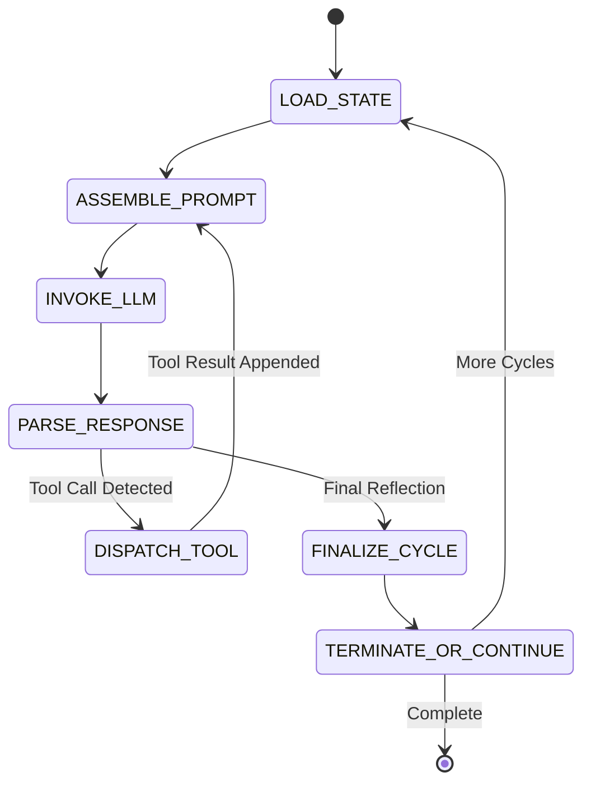
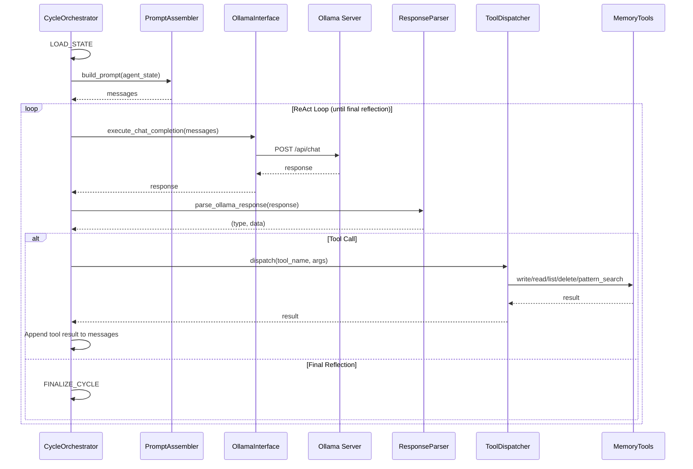
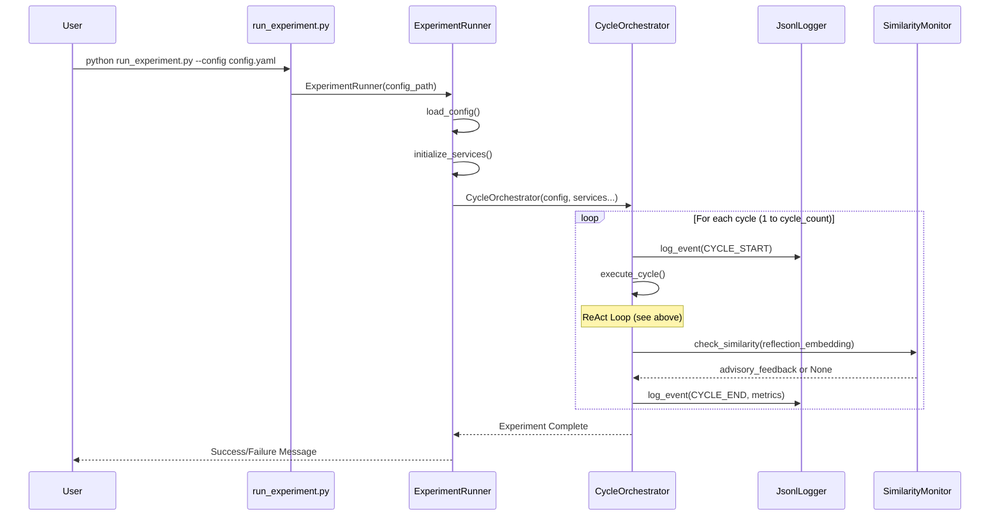
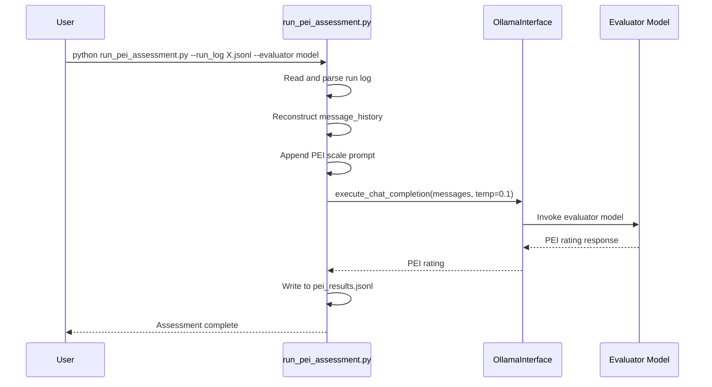

# Core Workflows

### State Machine Workflow

The ContReAct cycle implemented as a formal state machine:

### ReAct Sub-Loop Sequence

Detailed sequence diagram for a single cycle's ReAct loop:

### Complete Experiment Run Workflow

### PEI Assessment Workflow


