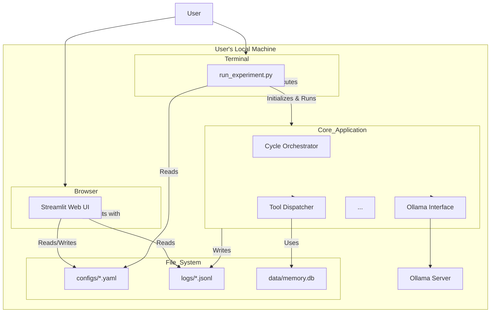

# High-Level Architecture

### Technical Summary

This project will be a locally-executed, Python-based application architected as a **Modular Monolith**. The system is composed of a core backend engine that runs experiments via a command-line interface, and a decoupled Streamlit-based web UI for configuration and analysis. Communication between the UI and the backend is handled asynchronously via the file system. The primary external dependency is a locally running Ollama server for LLM inference. This pragmatic, self-contained architecture is designed to be simple, portable, and easy to run on a personal machine, directly supporting the project's goal of providing a hands-on learning experience.

### Platform and Infrastructure Choice

**Platform**: Local User Machine. This application is not designed for cloud hosting; it is a standalone tool to be run on a developer's or researcher's personal computer.

**Key Services**: The platform relies on a minimal set of services:

- Python 3.9+ Runtime
- A locally running Ollama Server instance
- The local File System for data exchange and persistence (`configs/`, `logs/`, `data/`)

### Repository Structure

**Structure**: Monorepo. A single repository will contain the core application logic, the Streamlit UI scripts, analysis scripts, and all related documentation.

**Monorepo Tool**: N/A - A standard directory structure will be sufficient without the need for specialized monorepo management tools.

### High-Level Architecture Diagram

### Architectural Patterns

- **Modular Monolith**: The backend is designed with a clear separation of concerns between its primary components but is packaged and run as a single application.

- **State Machine**: The core ContReAct cycle is explicitly implemented as a formal state machine, providing a robust, predictable, and highly debuggable structure for the agent's complex operational loop.

- **Configuration-Driven Design**: The behavior of an experiment is entirely controlled by an external config.yaml file. This decouples the application logic from the experimental parameters, making runs highly reproducible and easy to manage.

- **Decoupled UI (via File System)**: The Streamlit UI and the core backend engine are completely decoupled. They do not share memory or have direct API calls; they communicate only by reading and writing files.

