# ContReAct-Ollama Experimental Platform UI/UX Specification

## Introduction

This document defines the user experience goals, information architecture, user flows, and visual design specifications for the ContReAct-Ollama Experimental Platform's user interface. It serves as the foundation for visual design and frontend development, ensuring a cohesive and user-centered experience.

### Change Log

| Date | Version | Description | Author |
|------|---------|-------------|--------|
| 2025-10-01 | 1.0 | Initial draft of UI/UX Specification | Sally, UX Expert |

## Overall UX Goals & Principles

### Target User Personas

I will be designing for the two personas defined in the PRD:

- **The AI Researcher / Hobbyist**: For this technical user, "simple" means *efficient*. The interface should be a powerful tool that streamlines their existing workflow without getting in their way.

- **The Curious AI Enthusiast**: For this less-technical user, "simple" means *approachable*. The interface should be intuitive and guide them through the process of experimentation and analysis without requiring deep technical knowledge.

### Usability Goals

To achieve simplicity, we will target the following usability goals:

- **Ease of Learning**: A new user should be able to configure and save their first experiment within 10 minutes of opening the web UI.

- **Efficiency of Use**: An experienced user should be able to load a previous experiment, change a parameter, and save it as a new configuration in under 60 seconds.

- **Error Prevention**: The configuration form will provide immediate validation to prevent users from saving an invalid configuration.

- **Memorability**: The interface will be intuitive enough that a user can return after a week and not have to re-learn the workflow.

### Design Principles

We will follow these core principles to ensure a simple and effective design:

1. **Clarity Over Cleverness**: Prioritize clear, unambiguous labels and straightforward layouts over novel or complex interface designs.

2. **Progressive Disclosure**: Show only the most essential configuration options by default. More advanced or less frequently used parameters (e.g., `repeat_penalty`, `num_ctx`) will be available in an "Advanced Settings" section.

3. **Focus on the Task**: Every element on the screen must have a clear purpose. We will avoid visual clutter to keep the user's focus on either configuring an experiment or analyzing the results.

4. **Consistency**: The patterns used for creating a configuration (forms, buttons) and viewing results (dropdowns, tables, charts) will be consistent, making the application feel predictable and reliable.

## Information Architecture (IA)

### Site Map / Screen Inventory

This diagram shows the high-level structure of the web application and the key functions available on each page, as derived from the Software Design Specification.

```mermaid
graph TD
    A[Web Application] --> B[🧪 Experiment Configuration]
    A --> C[📊 Results Dashboard]
    
    subgraph Configuration Page
        B1[Create New Config via Form]
        B2[Edit Existing Config via Dropdown]
    end
    
    subgraph Results Page
        C1[Select Run via Dropdown]
        C2[Display Summary Metrics]
        C3[Display PEI Results Table]
        C4[Display Interactive Charts]
        C5[View Raw Conversation Log]
    end
    
    B -- Manages --> B_Data[(configs/*.yaml)]
    C -- Reads --> C_Data[(logs/*.jsonl)]
```



### Navigation Structure

**Primary Navigation**: The application will use a standard multi-page layout. Streamlit will automatically generate a sidebar menu containing links to the two primary pages: "🧪 Experiment Configuration" and "📊 Results Dashboard".

**Secondary Navigation**: Navigation within each page will be handled by context-specific widgets. For example, a dropdown menu will be used to select an existing configuration to edit or a completed run to analyze.

**Breadcrumb Strategy**: Given the flat, two-page structure of the application, a breadcrumb navigation system is not necessary.

## User Flows

### User Flow 1: Create a New Experiment Configuration

**User Goal**: To create and save a valid config.yaml file for a new experiment using the web interface.

**Entry Point**: User navigates to the "🧪 Experiment Configuration" page from the sidebar.

**Success Criteria**: A new, valid .yaml file is saved to the configs/ directory, and the user sees a confirmation message.

**Flow Diagram**:


**Edge Cases & Error Handling**:

- The run_id field is empty or contains characters that are invalid for a filename.
- A required numeric field (like cycle_count) is left empty or contains non-numeric text.
- The system should confirm with the user if they try to save a configuration with a run_id that already exists.
- The application should handle file system errors gracefully (e.g., if the configs/ directory is not writable).

### User Flow 2: View Experiment Results

**User Goal**: To select a completed experiment and view its summary metrics, charts, and raw log data.

**Entry Point**: User navigates to the "📊 Results Dashboard" page from the sidebar.

**Success Criteria**: The dashboard correctly populates with the metrics, charts, and log data corresponding to the selected run.

**Flow Diagram**:


**Edge Cases & Error Handling**:

- The logs/ directory is empty, and a helpful message should be displayed.
- A selected .jsonl file is malformed or corrupted, and a user-friendly error should be shown.
- The log file is missing expected data, which should be handled gracefully without crashing the dashboard (e.g., show "N/A" for a metric).
- The log file is exceptionally large, and the application should ideally show a loading indicator while processing.

## Wireframes & Mockups

### Key Screen Layouts

#### Screen: Experiment Configuration Page

**Purpose**: To allow users to create a new experiment configuration or load and edit an existing one, providing an intuitive alternative to manual YAML editing.

**Conceptual Layout**:

```
+-------------------------------------------------------------------+
| Sidebar (Navigation)              | Main Content                  |
|-----------------------------------|-------------------------------|
| * 🧪 Experiment Configuration     | [ Load Existing Config ▼ ]   |
|   📊 Results Dashboard            |                               |
|                                   | --- Begin Form -------------- |
|                                   |                               |
|                                   | Run ID: [ text_input ]        |
|                                   | Model Name: [ text_input ]    |
|                                   | Cycle Count: [ number_input ] |
|                                   |                               |
|                                   | ▾ Advanced Model Options      |
|                                   |   Seed: [ number_input ]      |
|                                   |   Temperature: [ slider ]     |
|                                   |   ... (other options) ...     |
|                                   |                               |
|                                   | [ Save Configuration ]        |
|                                   |                               |
|                                   | --- End Form ---------------- |
|                                   |                               |
+-------------------------------------------------------------------+
```

**Key Elements**:

- **Load Existing Dropdown**: A select box to choose from .yaml files already in the configs/ directory.
- **Configuration Form**: A form to group all the input widgets for submission.
- **Basic Inputs**: Text and number inputs for the most common parameters.
- **Advanced Options Expander**: An expandable section that hides less-frequently used model parameters, aligning with our "Progressive Disclosure" design principle.
- **Save Button**: A submit button to write the configuration to a .yaml file.

**Interaction Notes**:

- Selecting a configuration from the dropdown will populate the form with its values.
- Clicking "Save" will validate the inputs, generate the file, and display a success confirmation.

**Design File Reference**: N/A - This text-based wireframe serves as the design reference.

#### Screen: Results Dashboard Page

**Purpose**: To allow users to select a completed experiment run and visualize its results in a clear, interactive way.

**Conceptual Layout**:

```
+-------------------------------------------------------------------+
| Sidebar (Navigation)              | Main Content                  |
|-----------------------------------|-------------------------------|
|   🧪 Experiment Configuration     | [ Select Run to Analyze ▼ ]  |
| * 📊 Results Dashboard            |                               |
|                                   | --- Summary Metrics --------- |
|                                   |                               |
|                                   | Total Cycles: 10              |
|                                   | Memory Ops: 38                |
|                                   | Messages: 7                   |
|                                   |                               |
|                                   | --- Charts ------------------ |
|                                   |                               |
|                                   | [ Interactive Chart (Plotly)] |
|                                   |                               |
|                                   | --- Raw Log ----------------- |
|                                   |                               |
|                                   | ▾ View Full Conversation Log  |
|                                   |                               |
+-------------------------------------------------------------------+
```

**Key Elements**:

- **Select Run Dropdown**: A select box populated with the run_id of all .jsonl files found in the logs/ directory.
- **Summary Metrics**: A series of st.metric widgets to display key statistics at a glance.
- **Interactive Chart**: A Plotly chart area for visualizing trends in the data, such as tool usage per cycle.
- **Log Viewer**: An expandable section that will contain the formatted raw conversation and event history for deep-dive analysis.

**Interaction Notes**:

- The dashboard will initially be empty or show a placeholder message.
- Selecting a run from the dropdown will trigger data loading and populate all the display elements on the page.

**Design File Reference**: N/A - This text-based wireframe serves as the design reference.

## Component Library / Design System

### Design System Approach

We will not be creating a custom component library. Instead, we will exclusively use the built-in, pre-styled components provided by the Streamlit framework. This approach ensures perfect visual consistency, significantly accelerates development, and aligns with the project's goal of creating a simple, functional data application without requiring custom front-end code.

### Core Components

**Component: Form Inputs** (`st.text_input`, `st.number_input`, `st.slider`)
- **Purpose**: To gather all the parameters for an experiment configuration.

**Component: Select Box** (`st.selectbox`)
- **Purpose**: To allow users to select an existing configuration file to load or a completed run log to analyze.

**Component: Button** (`st.form_submit_button`)
- **Purpose**: To trigger the action of saving an experiment configuration.

**Component: Data Display** (`st.metric`, `st.dataframe`)
- **Purpose**: To display summary statistics and detailed tabular data from the experiment logs.

**Component: Expander** (`st.expander`)
- **Purpose**: To conditionally hide complex or lengthy content, such as "Advanced Model Options" and the "View Full Conversation Log".

**Component: Chart** (`st.plotly_chart`)
- **Purpose**: To provide interactive visualizations of the experimental data.

## Branding & Style Guide

### Visual Identity

**Brand Guidelines**: N/A. The style will be dictated by the clean, default light and dark themes of the Streamlit framework.

### Color Palette

The application will use Streamlit's default color palette, optimized for readability.

| Color Type | Usage |
|------------|-------|
| Primary | Interactive elements like sliders and buttons. |
| Text | Default text colors for the selected theme. |
| Status | Standard colors (green, yellow, red) for notifications. |

### Typography

**Font Families**: The application will use the default sans-serif font stack provided by Streamlit.

**Type Scale**: We will use Streamlit's default semantic type scale for headings and body text.

### Iconography

**Icon Library**: We will use standard Unicode emojis for iconography in page navigation.

**Usage Guidelines**: Icons will be used sparingly to provide quick visual cues.

### Spacing & Layout

**Grid System**: The primary layout will be a single column, with st.columns used for side-by-side elements.

**Spacing Scale**: We will adhere to the default spacing provided by the Streamlit framework.

## Accessibility Requirements

### Compliance Target

**Standard**: No formal compliance standard (e.g., WCAG 2.1) is required. We will rely on the default accessibility features of the Streamlit framework.

### Key Requirements

**Interaction**: We will use standard Streamlit components, which render as semantic HTML and provide basic support for keyboard navigation and screen readers.

**Content**: We will use Streamlit's built-in functions for headers and labels to ensure a logical document structure.

### Testing Strategy

No automated accessibility testing is required. A brief manual check will be conducted to ensure basic keyboard navigability.

## Responsiveness Strategy

### Breakpoints

| Breakpoint | Target Behavior |
|------------|-----------------|
| Desktop / Wide Screens | The main content area and the navigation sidebar will be visible side-by-side. |
| Tablet / Mobile Screens | The sidebar will be collapsed by default and can be toggled open via a menu icon. |

### Adaptation Patterns

**Layout Changes**: The layout will shift from two columns to a single column on narrower screens. st.columns will stack vertically on mobile.

**Navigation Changes**: The main sidebar navigation will collapse into a hamburger menu icon on mobile viewports.

## Animation & Micro-interactions

### Motion Principles

- **Purposeful**: Animations will only be used to provide feedback or guide attention.
- **Subtle**: All motion will be fast, subtle, and non-disruptive.
- **Framework-Driven**: We will rely exclusively on the default animations provided by Streamlit and Plotly.

### Key Animations

- **Widget Feedback**: Subtle hover effects and focus indicators on interactive elements.
- **Status Notifications**: Simple fade transitions for status messages.
- **Interactive Chart Animations**: Smooth transitions and tooltips within Plotly charts.

## Performance Considerations

### Performance Goals

- **Initial Page Load**: The application should load in under 2 seconds.
- **UI Interaction**: All widgets must respond to user input instantaneously.
- **Data Loading**: A standard 10-cycle log file should be processed in under 5 seconds. A loading indicator (`st.spinner`) will be shown for longer operations.

### Design Strategies

- **Leverage Framework Efficiency**: Rely on Streamlit's efficient, built-in components.
- **Efficient Data Parsing**: Use the Pandas library to parse .jsonl log files.
- **Provide Loading Feedback**: Use `st.spinner` during time-consuming operations.
- **On-Demand Processing**: Data processing will only be triggered when a user selects a run.

## Next Steps

### Immediate Actions

- **Final Approval**: Approve this completed UI/UX Specification document.
- **Handoff to Architect**: Hand off this document and the PRD to the Architect to begin the fullstack architecture design.

### Design Handoff Checklist

- [x] All user flows documented
- [x] Component inventory complete
- [x] Accessibility requirements defined
- [x] Responsive strategy clear
- [x] Brand guidelines incorporated
- [x] Performance goals established
